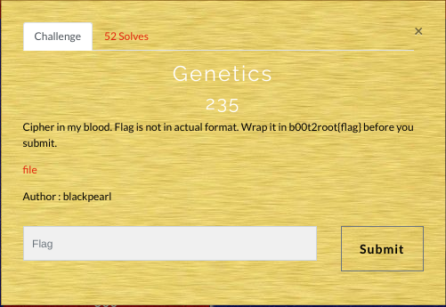
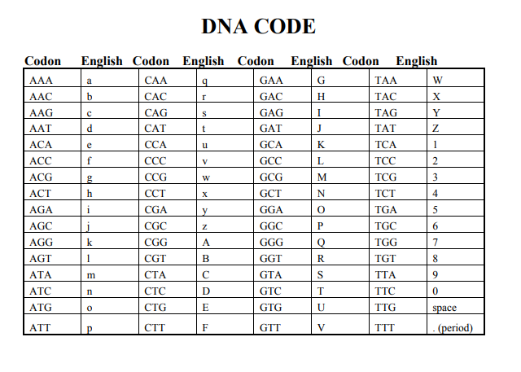

# GENETICS (300)

## Category: Crypto

## Difficulty: Easy(:P)

### Writeup :

    This CTF was quite an interesting one. This was the first challenge that I solved(1st Blood :P). So to start with a Sequence of characters conataining A,C,G & T was given. So if u know Biology then u know it was a DNA Sequence. 
> ACCAGTAAAACGTTGAGACAGTTGAATATCAAACTACACCGAATTCATATGTCACAGCGGCCGACACAGATGATAACA
    
    Thanks to John_Hammond for this Gr8 Katana (https://github.com/JohnHammond/ctf-katana).

Then Decoding it manually gave me the flag. 
 

> b00t2root{dnacrypto1sAwesome}